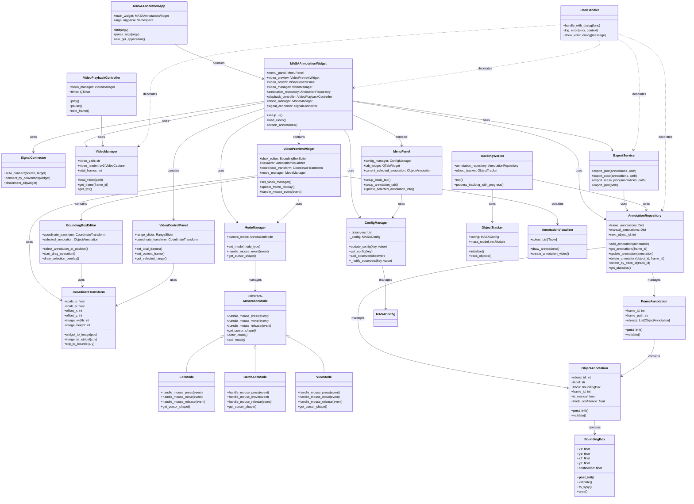

リファクタリング後のクラス図を以下に示します：

## 主要な改善点

### 1. **責務の明確化**
- `VideoAnnotationManager` → `VideoManager` + `AnnotationRepository` + `ExportService`
- 各クラスが単一責任を持つように分離

### 2. **共通機能の統合**
- `CoordinateTransform`: 座標変換ロジックの一元化
- `ConfigManager`: 設定管理の統合
- `ErrorHandler`: エラーハンドリングの統一

### 3. **状態管理の改善**
- `ModeManager` + `AnnotationMode`: 状態パターンによるモード管理
- 複数のモードフラグを統一的に管理

### 4. **シグナル接続の簡素化**
- `SignalConnector`: 命名規則に基づく自動接続
- 冗長なシグナル接続コードを削減

### 5. **データ検証の強化**
- 全データクラスに `validate()` メソッドを追加
- `__post_init__()` での自動検証

この改善により、コードの可読性、保守性、拡張性が大幅に向上し、重複コードが削減されます。