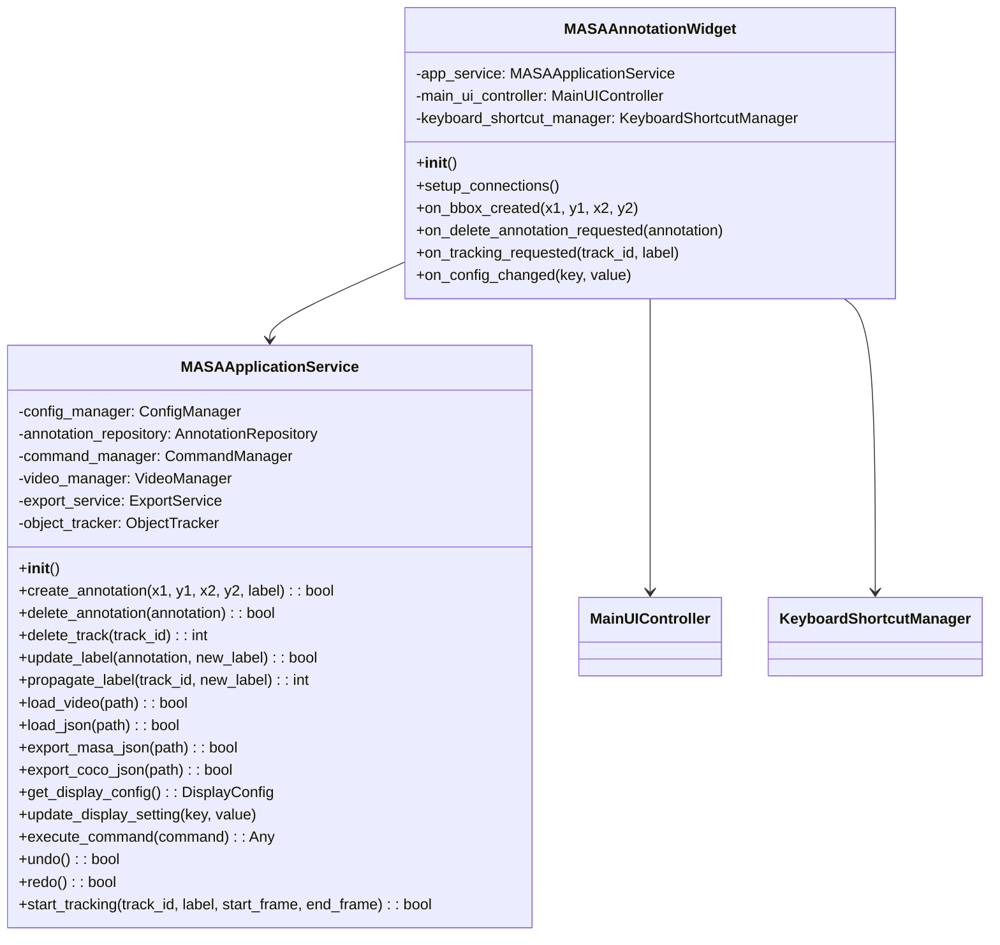
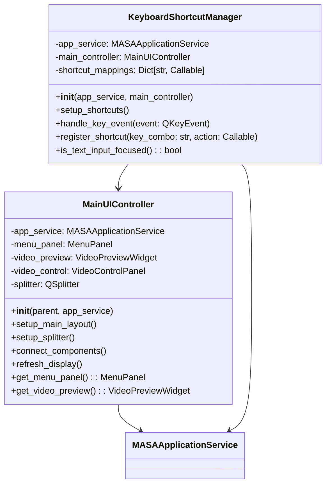
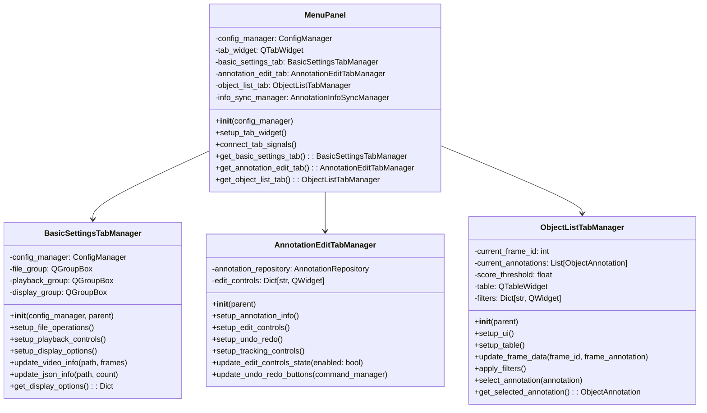
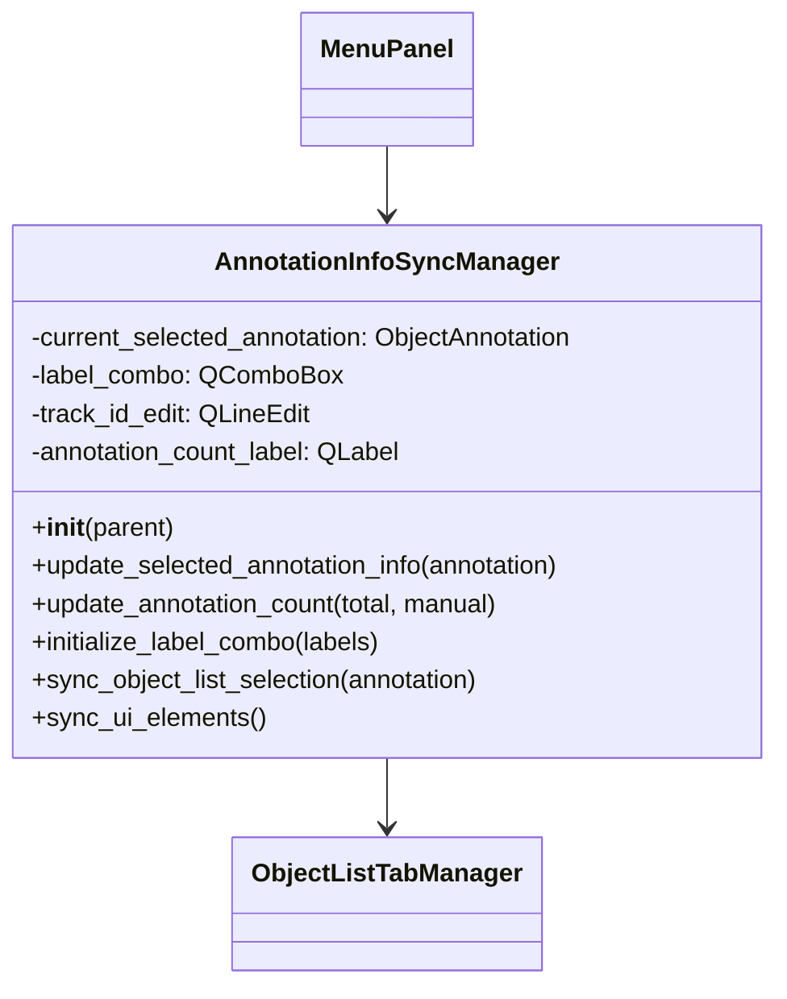
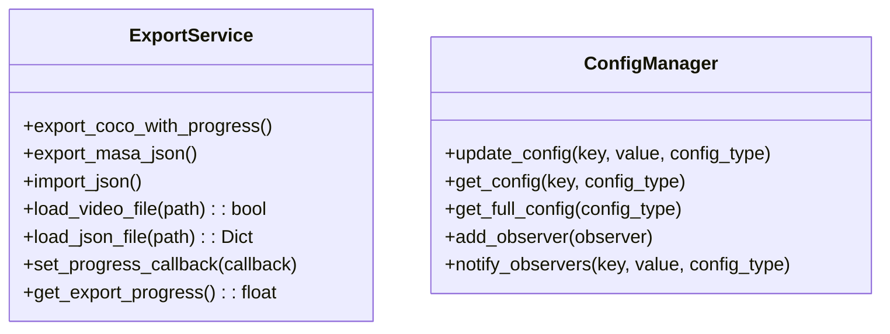
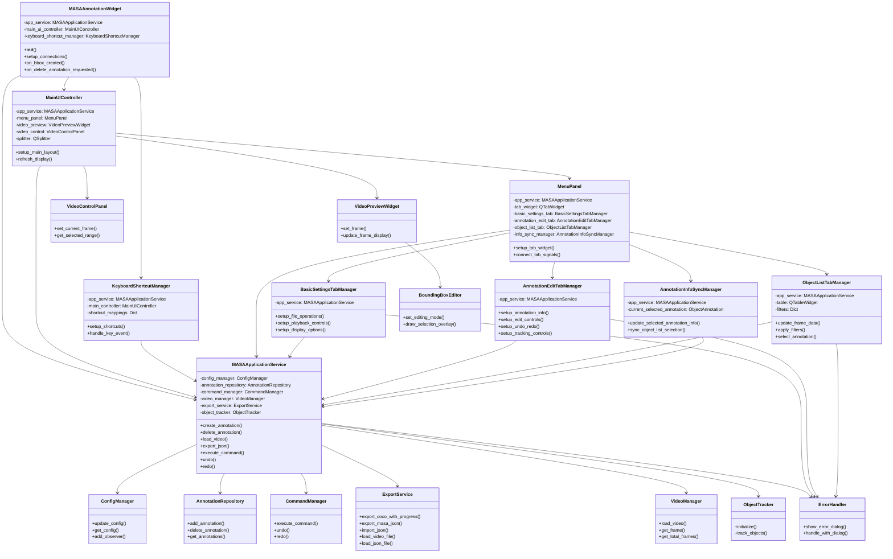
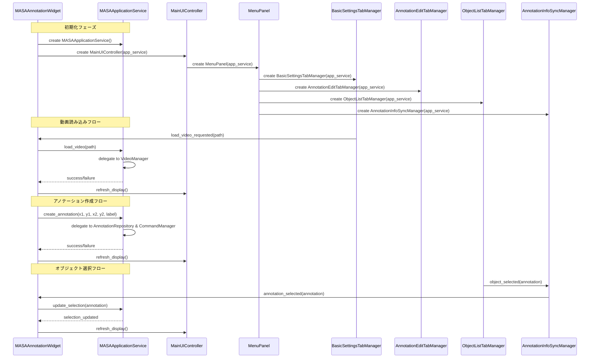

# MASAAnnotationTool リファクタリング計画 - クラス図（ファサードパターン版）

## 概要
MASAAnnotationWidget.py（895行）とMenuPanel.py（733行）の肥大化を解決するためのリファクタリング計画のクラス図です。
ファサードパターンを採用し、依存関係を整理して可読性を向上させます。

## 現在の問題
- **MASAAnnotationWidget.py**: 895行（UI、イベント処理、ビジネスロジック、状態管理、ファイル操作が混在）
- **MenuPanel.py**: 733行（複数タブのUI、設定管理、ボタンアクション、状態同期が混在）
- **依存関係の複雑化**: MASAAnnotationWidgetが多くのクラスを直接参照

## リファクタリング後のクラス構成

### 1. ファサード層（新規追加）



### 2. UI管理層



### 3. メニューパネル層



### 4. 情報同期管理層



### 5. 既存クラス（拡張）



## 全体クラス図

### ファサードパターンによる全体アーキテクチャ



## シグナル/スロット接続図（ファサードパターン版）



## ファイル構成（ファサードパターン版）

### リファクタリング後のファイル一覧

```
AutoAnnotationTool/src/MASAAnnotationApp/
├── MASAApplicationService.py            # 200行程度（ファサード層）
├── MASAAnnotationWidget.py              # 200行程度（メイン統合・大幅縮小）
├── MainUIController.py                  # 200行程度（UIレイアウト）
├── KeyboardShortcutManager.py           # 150行程度（ショートカット）
├── MenuPanel.py                         # 150行程度（タブ統合・縮小）
├── BasicSettingsTabManager.py           # 200行程度（基本設定タブ）
├── AnnotationEditTabManager.py          # 200行程度（編集タブ）
├── ObjectListTabManager.py              # 350行程度（オブジェクト一覧タブ）
├── AnnotationInfoSyncManager.py         # 150行程度（情報同期）
└── ExportService.py                     # 200行程度（拡張済み）
```

### 既存ファイル（変更なし）
```
├── AnnotationRepository.py              # データ管理
├── CommandPattern.py                    # コマンドパターン
├── ConfigManager.py                     # 設定管理
├── VideoPreviewWidget.py                # 動画表示
├── BoundingBoxEditor.py                 # 編集機能
├── ErrorHandler.py                      # エラー処理
└── その他のユーティリティクラス
```

## ファサードパターンによるリファクタリングの利点

### 1. 依存関係の大幅削減 ⭐
- **Before**: MASAAnnotationWidgetが6つのクラスを直接参照
- **After**: MASAApplicationServiceのみを参照（83%の依存関係削減）
- 新しいサービス追加時にメインクラスを変更不要

### 2. 可読性の向上 ⭐⭐
- メソッド名が直感的（`app.create_annotation()`, `app.load_video()`）
- 処理の流れが追いやすい
- IDEの補完機能が効果的に働く

### 3. 単一責任原則の実現
- **MASAAnnotationWidget**: UI統合とイベント処理のみ
- **MASAApplicationService**: ビジネスロジックの窓口
- **各TabManager**: 特定タブの責任のみ

### 4. テスタビリティの向上
- `MASAApplicationService`をモック化すれば全体テスト可能
- 各Managerの独立テストが容易
- 依存関係がシンプルでテストケース作成が簡単

### 5. 保守性の向上
- ファイルサイズが適切（150-350行）
- 機能の所在が明確
- デバッグ時の問題箇所特定が容易

### 6. 拡張性の向上
- 新機能は`MASAApplicationService`にメソッド追加のみ
- 新しいタブ追加が標準化されたパターンで可能
- UIとビジネスロジックが完全分離

## 従来案との比較

| 項目 | 従来案 | ファサードパターン |
|------|--------|------------------|
| 依存関係数 | 6個 | 1個 |
| MASAAnnotationWidget行数 | 300行 | 200行 |
| 可読性 | 中 | 高 |
| テスト容易さ | 低 | 高 |
| 学習コスト | 中 | 低 |

## 実装順序（ファサードパターン版）

### フェーズ1: ファサード層の構築
1. **MASAApplicationService**の作成
   - 既存サービスクラスの統合
   - 直感的なメソッド名でのAPI設計
   - エラーハンドリングの統一

### フェーズ2: UI層のリファクタリング
2. **MainUIController**の作成
   - UIレイアウト管理の分離
   - app_serviceとの連携
3. **KeyboardShortcutManager**の作成
   - ショートカット処理の分離
   - app_serviceとの連携

### フェーズ3: MenuPanel層の分離
4. **基本タブマネージャー**の作成
   - BasicSettingsTabManager
   - AnnotationEditTabManager  
   - ObjectListTabManager（CurrentFrameObjectListWidgetの改名）
5. **AnnotationInfoSyncManager**の作成
   - 情報同期処理の分離

### フェーズ4: 統合とテスト
6. **MASAAnnotationWidgetのリファクタリング**
   - 既存機能の各Managerへの移行
   - シグナル/スロット接続の整理
7. **MenuPanelのリファクタリング**
   - タブ管理のみに責任を限定
8. **統合テスト**
   - 機能テスト
   - パフォーマンステスト

## 移行戦略

### 段階的移行
1. **並行開発**: 既存コードを動作させながら新クラスを作成
2. **機能単位移行**: 1つの機能ずつ新アーキテクチャに移行
3. **テスト駆動**: 各段階でテストを実行して品質確保

### リスク軽減
- 既存インターフェースの保持
- バックアップとロールバック計画
- 段階的リリースとフィードバック収集

この設計により、**可読性**、**保守性**、**拡張性**の高いアーキテクチャを実現し、将来の機能追加や変更に柔軟に対応できるようになります。
