# `MASAAnnotationApp`のクラス図を更新

これまでの会話で、`MASAAnnotationApp`の主要なコンポーネントである`MASAAnnotationWidget`、`MenuPanel`、`VideoControlPanel`、`VideoPreviewWidget`、`ObjectTracker`、`TrackingWorker`、そして新しく導入された`TrackingResultConfirmDialog`に機能追加や修正が行われました。

これらの変更を反映したクラス図を以下に示します。

```mermaid
classDiagram
    %% エントリーポイント
    class MASAAnnotationApp {
        +main_widget: MASAAnnotationWidget
        +args: argparse.Namespace
        +__init__(argv)
        +parse_args(argv)
        +run_gui_application()
    }

    %% メインウィジェット
    class MASAAnnotationWidget {
        +menu_panel: MenuPanel
        +video_preview: VideoPreviewWidget
        +video_control: VideoControlPanel
        +video_manager: VideoManager
        +annotation_repository: AnnotationRepository
        +playback_controller: VideoPlaybackController
        +object_tracker: ObjectTracker
        +tracking_worker: TrackingWorker
        +export_worker: ExportWorker
        +temp_bboxes_for_batch_add: List[Tuple[int, BoundingBox]]
        +setup_ui()
        +load_video(file_path)
        +export_annotations(format)
        +start_tracking(assigned_track_id, assigned_label)
        +on_tracking_completed(results)
        +keyPressEvent(event)
        +set_edit_mode(enabled)
        +set_batch_add_mode(enabled)
        +on_export_progress(current, total)
        +on_export_completed()
        +on_export_error(message)
    }

    %% 新しいユーティリティクラス
    class CoordinateTransform {
        +scale_x: float
        +scale_y: float
        +offset_x: int
        +offset_y: int
        +image_width: int
        +image_height: int
        +widget_to_image(pos)
        +image_to_widget(x, y)
        +clip_to_bounds(x, y)
    }

    class ConfigManager {
        -_observers: List
        -_config: MASAConfig
        +update_config(key, value)
        +get_config(key)
        +add_observer(observer)
        +_notify_observers(key, value)
    }

    class ErrorHandler {
        +handle_with_dialog(func)
        +log_error(error, context)
        +show_error_dialog(message)
    }

    %% モード管理（状態パターン）
    class ModeManager {
        +current_mode: AnnotationMode
        +set_mode(mode_type)
        +handle_mouse_event(event)
        +get_cursor_shape()
    }

    class AnnotationMode {
        <<abstract>>
        +handle_mouse_press(event)*
        +handle_mouse_move(event)*
        +handle_mouse_release(event)*
        +get_cursor_shape()*
        +enter_mode()*
        +exit_mode()*
    }

    class EditMode {
        +handle_mouse_press(event)
        +handle_mouse_move(event)
        +handle_mouse_release(event)
        +get_cursor_shape()
    }

    class BatchAddMode {
        +handle_mouse_press(event)
        +handle_mouse_move(event)
        +handle_mouse_release(event)
        +get_cursor_shape()
    }

    class ViewMode {
        +handle_mouse_press(event)
        +handle_mouse_move(event)
        +handle_mouse_release(event)
        +get_cursor_shape()
    }

    %% 責務分離されたデータ管理
    class VideoManager {
        +video_path: str
        +video_reader: cv2.VideoCapture
        +total_frames: int
        +fps: float
        +width: int
        +height: int
        +lock: threading.Lock
        +load_video()
        +get_frame(frame_id)
        +get_fps()
        +get_total_frames()
        +get_video_width()
        +get_video_height()
        +release()
    }

    class AnnotationRepository {
        +frame_annotations: Dict
        +manual_annotations: Dict
        +next_object_id: int
        +add_annotation(annotation)
        +get_annotations(frame_id)
        +update_annotation(annotation)
        +delete_annotation(object_id, frame_id)
        +delete_by_track_id(track_id)
        +get_statistics()
        +get_all_labels()
    }

    class ExportService {
        +export_masa_json(annotations, video_path, file_path)
        +export_coco(annotations, video_path, file_path, video_manager)
        +export_coco_with_progress(annotations, video_path, file_path, video_manager, progress_callback)
        +import_json(path)
    }

    %% 改善されたUIコンポーネント
    class VideoPreviewWidget {
        +bbox_editor: BoundingBoxEditor
        +visualizer: AnnotationVisualizer
        +coordinate_transform: CoordinateTransform
        +mode_manager: ModeManager
        +temp_batch_annotations: List
        +score_threshold: float
        +set_video_manager(video_manager)
        +set_annotation_repository(repo)
        +update_frame_display()
        +handle_mouse_event(event)
        +clear_temp_batch_annotations()
        +set_mode(mode_name)
        +set_editing_mode(enabled)
    }

    class BoundingBoxEditor {
        +coordinate_transform: CoordinateTransform
        +selected_annotation: ObjectAnnotation
        +is_editing: bool
        +selection_changed: pyqtSignal
        +set_editing_mode(enabled)
        +select_annotation_at_position(pos, annotations)
        +start_drag_operation(pos)
        +draw_selection_overlay(frame)
        +start_new_bbox_drawing(start_point)
    }

    class MenuPanel {
        +config_manager: ConfigManager
        +tab_widget: QTabWidget
        +current_selected_annotation: ObjectAnnotation
        +edit_mode_btn: QPushButton
        +batch_add_annotation_btn: QPushButton
        +complete_batch_add_btn: QPushButton
        +delete_track_btn: QPushButton
        +export_progress_label: QLabel
        +load_video_requested: pyqtSignal
        +load_json_requested: pyqtSignal
        +export_requested: pyqtSignal
        +edit_mode_requested: pyqtSignal
        +batch_add_mode_requested: pyqtSignal
        +tracking_requested: pyqtSignal
        +delete_single_annotation_requested: pyqtSignal
        +delete_track_requested: pyqtSignal
        +setup_ui()
        +setup_basic_tab()
        +setup_annotation_tab()
        +update_selected_annotation_info()
        +_on_edit_mode_clicked(checked)
        +_on_batch_add_annotation_clicked(checked)
        +_on_complete_batch_add_clicked()
        +_on_delete_track_clicked()
        +_on_delete_single_annotation_clicked()
        +update_export_progress(message)
    }

    class VideoControlPanel {
        +range_slider: RangeSlider
        +frame_slider: QSlider
        +frame_info_label: QLabel
        +frame_input: QLineEdit
        +jump_btn: QPushButton
        +frame_changed: pyqtSignal
        +range_changed: pyqtSignal
        +range_frame_preview: pyqtSignal
        +set_total_frames(total_frames)
        +set_current_frame(frame_id)
        +get_selected_range()
        +prev_frame()
        +next_frame()
        +jump_to_frame()
    }

    %% 改善されたデータクラス（バリデーション付き）
    class BoundingBox {
        +x1: float
        +y1: float
        +x2: float
        +y2: float
        +confidence: float
        +__post_init__()
        +validate()
        +to_xyxy()
        +area()
    }

    class ObjectAnnotation {
        +object_id: int
        +label: str
        +bbox: BoundingBox
        +frame_id: int
        +is_manual: bool
        +track_confidence: float
        +is_batch_added: bool
        +__post_init__()
        +validate()
    }

    class FrameAnnotation {
        +frame_id: int
        +frame_path: str
        +objects: List[ObjectAnnotation]
        +__post_init__()
        +validate()
    }

    %% その他のクラス
    class ObjectTracker {
        +config: MASAConfig
        +masa_model: nn.Module
        +last_frame_id: int
        +initialize()
        +track_objects(frame, frame_id, initial_annotations, texts)
        +reset_tracking_state()
        +_convert_track_result_to_annotations(track_result, frame_id, texts)
    }

    class TrackingWorker {
        +video_manager: VideoManager
        +annotation_repository: AnnotationRepository
        +object_tracker: ObjectTracker
        +start_frame: int
        +end_frame: int
        +initial_annotations: List
        +assigned_track_id: int
        +assigned_label: str
        +max_used_track_id: int
        +progress_updated: pyqtSignal
        +tracking_completed: pyqtSignal
        +error_occurred: pyqtSignal
        +run()
        +process_tracking_with_progress()
    }

    class ExportWorker {
        +export_service: ExportService
        +frame_annotations: Dict
        +video_path: str
        +file_path: str
        +video_manager: VideoManager
        +progress_updated: pyqtSignal
        +export_completed: pyqtSignal
        +error_occurred: pyqtSignal
        +run()
        +emit_progress(current, total)
    }

    class AnnotationVisualizer {
        +colors: List[Tuple]
        +draw_annotations(frame, annotations, show_ids, show_confidence, selected_annotation)
        +create_annotation_video()
    }

    class VideoPlaybackController {
        +video_manager: VideoManager
        +timer: QTimer
        +current_frame: int
        +is_playing: bool
        +fps: float
        +frame_updated: pyqtSignal
        +playback_finished: pyqtSignal
        +play(start_frame)
        +pause()
        +stop()
        +next_frame()
        +set_fps(fps)
    }

    class TrackingResultConfirmDialog {
        +tracking_results: Dict
        +video_manager
        +approved: bool
        +visualizer: AnnotationVisualizer
        +current_frame_id: int
        +grouped_tracking_results: Dict[int, List[ObjectAnnotation]]
        +track_selected: Dict[int, bool]
        +track_list_widget: QListWidget
        +preview_widget: QLabel
        +frame_slider: QSlider
        +frame_info_label: QLabel
        +annotation_info_label: QLabel
        +approve_btn: QPushButton
        +reject_btn: QPushButton
        +setup_ui()
        +update_preview()
        +display_frame(frame)
        +on_track_list_selection_changed()
        +on_track_item_check_changed(item)
        +get_selected_track_id()
        +approve_results()
        +reject_results()
    }

    %% 関係性
    MASAAnnotationApp --> MASAAnnotationWidget : contains
    
    MASAAnnotationWidget --> MenuPanel : contains
    MASAAnnotationWidget --> VideoPreviewWidget : contains
    MASAAnnotationWidget --> VideoControlPanel : contains
    MASAAnnotationWidget --> VideoManager : uses
    MASAAnnotationWidget --> AnnotationRepository : uses
    MASAAnnotationWidget --> ExportService : uses
    MASAAnnotationWidget --> ObjectTracker : uses
    MASAAnnotationWidget --> ConfigManager : uses
    MASAAnnotationWidget --> ErrorHandler : uses
    MASAAnnotationWidget --> VideoPlaybackController : uses
    MASAAnnotationWidget --> TrackingWorker : uses
    MASAAnnotationWidget --> ExportWorker : uses
    
    VideoPreviewWidget --> BoundingBoxEditor : contains
    VideoPreviewWidget --> AnnotationVisualizer : contains
    VideoPreviewWidget --> CoordinateTransform : uses
    VideoPreviewWidget --> ModeManager : uses
    VideoPreviewWidget --> VideoManager : uses
    VideoPreviewWidget --> AnnotationRepository : uses
    
    BoundingBoxEditor --> CoordinateTransform : uses
    
    VideoControlPanel --> CoordinateTransform : uses
    
    ModeManager --> AnnotationMode : manages
    AnnotationMode <|-- EditMode
    AnnotationMode <|-- BatchAddMode
    AnnotationMode <|-- ViewMode
    
    AnnotationRepository --> FrameAnnotation : manages
    AnnotationRepository --> ObjectAnnotation : manages
    
    ExportService --> AnnotationRepository : uses
    
    MenuPanel --> ConfigManager : uses
    MenuPanel --> AnnotationInputDialog : uses
    
    TrackingWorker --> VideoManager : uses
    TrackingWorker --> AnnotationRepository : uses
    TrackingWorker --> ObjectTracker : uses
    
    ExportWorker --> ExportService : uses
    ExportWorker --> VideoManager : uses
    
    VideoPlaybackController --> VideoManager : uses
    
    FrameAnnotation --> ObjectAnnotation : contains
    ObjectAnnotation --> BoundingBox : contains
    
    TrackingResultConfirmDialog --> VideoManager : uses
    TrackingResultConfirmDialog --> AnnotationVisualizer : uses
    TrackingResultConfirmDialog --> ObjectAnnotation : uses
    
    %% エラーハンドリング（全体に適用）
    ErrorHandler ..> MASAAnnotationWidget : decorates
    ErrorHandler ..> VideoManager : decorates
    ErrorHandler ..> AnnotationRepository : decorates
    ErrorHandler ..> ExportService : decorates
    ErrorHandler ..> ObjectTracker : decorates
    ErrorHandler ..> TrackingWorker : decorates
```

Notes:
- `MASAAnnotationWidget`は、`MenuPanel`、`VideoPreviewWidget`、`VideoControlPanel`、`VideoManager`、`AnnotationRepository`、`ExportService`、`ObjectTracker`、`VideoPlaybackController`、`TrackingWorker`、`ExportWorker`、`ConfigManager`、`ErrorHandler`といった主要なコンポーネントを保持または利用する中央オーケストレーターとして機能します。
- `VideoManager`には、マルチスレッド環境での安全なフレームアクセスを保証するために`threading.Lock`が追加されました。
- `ObjectTracker`には、フレーム間の連続性を追跡し、非連続なフレームが検出された場合に内部状態をリセットするための`last_frame_id`と`reset_tracking_state()`メソッドが追加されました。
- `TrackingWorker`は、単一物体追跡のシナリオをサポートするために、`process_tracking_with_progress()`メソッド内で`ObjectTracker`の状態をリセットし、`assigned_track_id`を一貫して使用するように修正されました。
- `ExportWorker`クラスが新しく追加され、COCO JSONエクスポートのような時間のかかる処理を進捗表示付きでバックグラウンドで実行できるようになりました。
- `TrackingResultConfirmDialog`が新しく追加され、追跡結果をTrack IDごとに確認し、承認または破棄する機能を提供します。このダイアログは、Track IDごとのチェックボックスとプレビュー機能を含みます。
- `MenuPanel`の`_on_batch_add_annotation_clicked`メソッドは、`AnnotationRepository`から現在の最大のTrack IDを取得し、`start_tracking`メソッドに渡すように変更されました。
- `MASAAnnotationWidget`の`start_tracking`メソッドは、BatchAddModeからの呼び出しを`VideoPreviewWidget.mode_manager.current_mode_name`で判断するように変更されました。
- `VideoPlaybackController`には、再生を停止し、フレームをリセットするための`stop()`メソッドが追加されました。
- `VideoManager`には、リソースを明示的に解放するための`release()`メソッドが追加されました。

これらの変更は、アプリケーションの堅牢性、ユーザーエクスペリエンス、および保守性を向上させることを目的としています。
